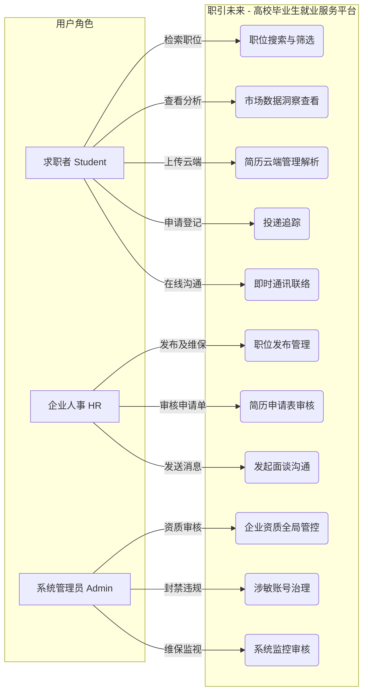
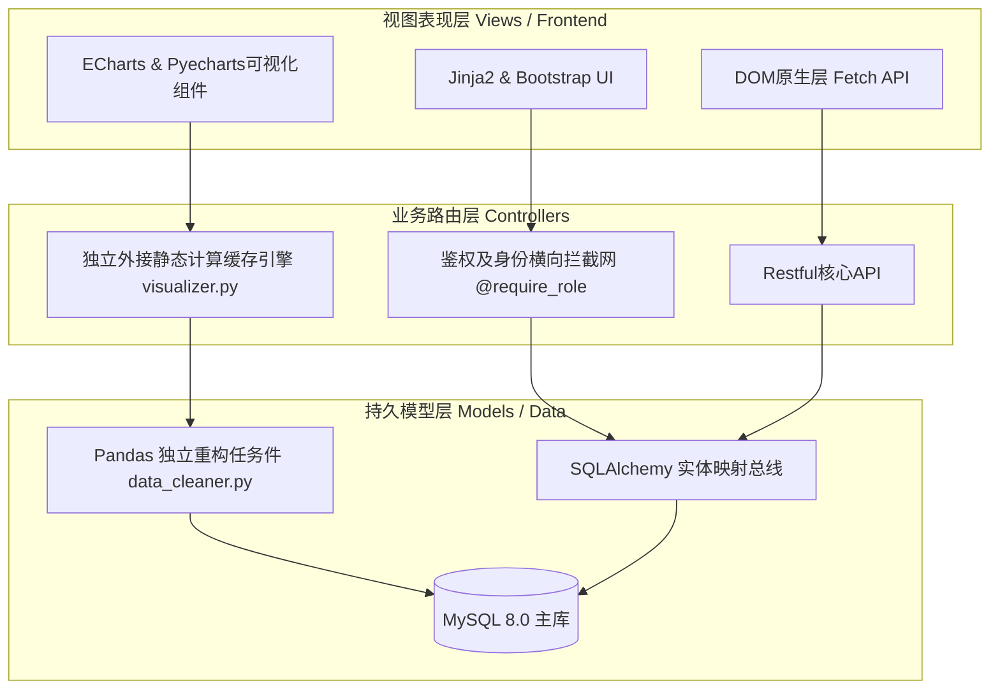
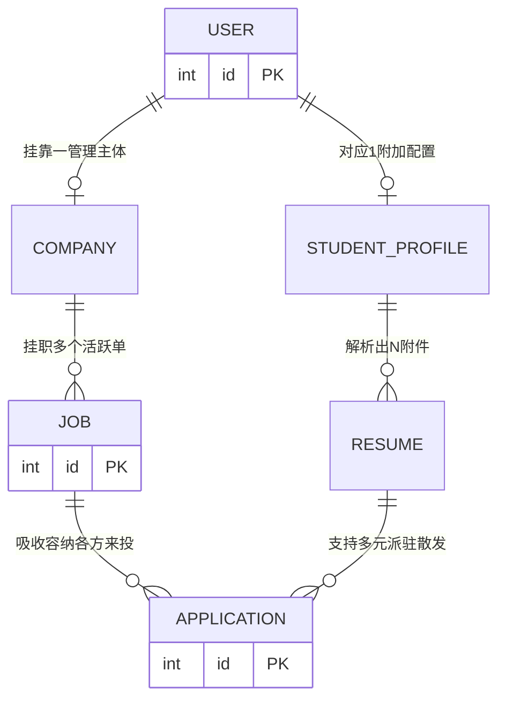
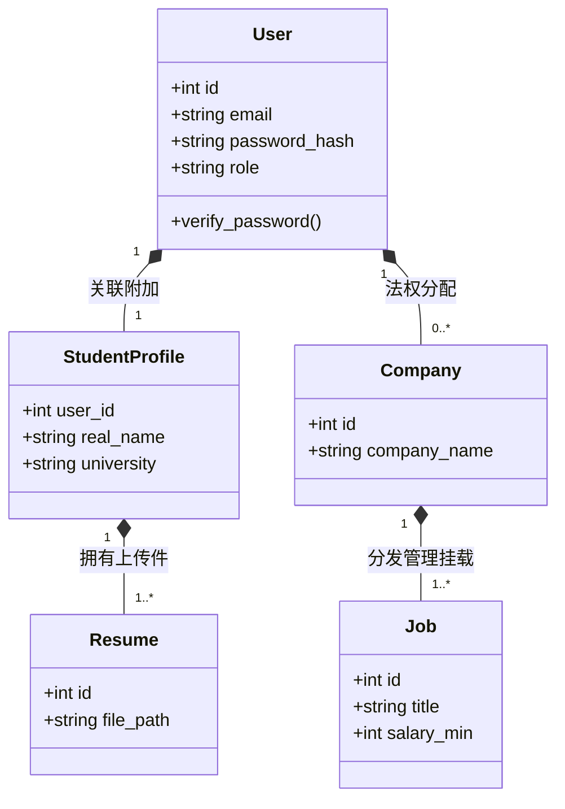
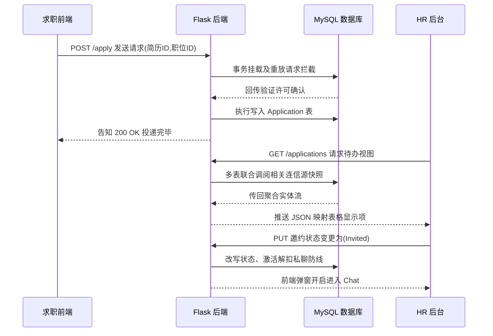
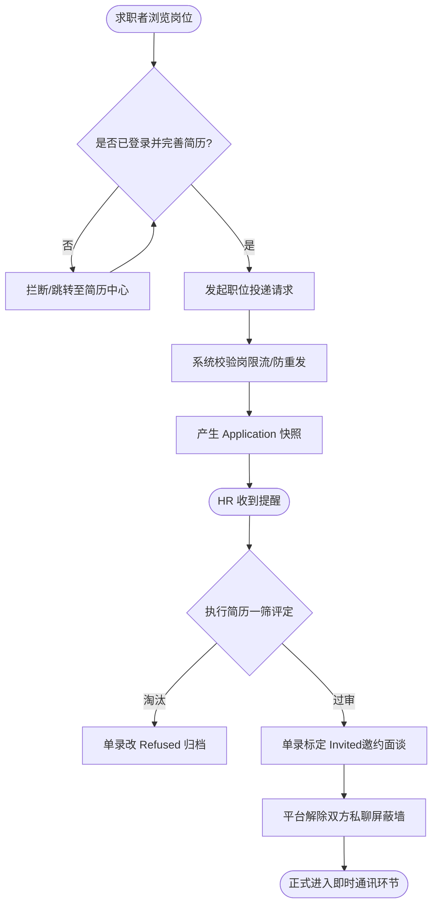

# 职引未来 - 高校毕业生就业服务平台 (综合项目开发与评估报告)

**项目名称**: 职引未来 - 高校毕业生就业服务平台
**技术栈**: Python 3.10+ / Flask 3.0 / SQLAlchemy / MySQL 8.0 / Pandas / ECharts / Bootstrap
**开发者**: 床垫子

> **说明**：本文档既是本项目的标准 README 说明文件，同时也是一份详尽的项目评估与验收报告，严格按照给定的核心章节与评分标准结构化组织，全面呈现项目的需求、规划、设计、开发、测试及最终反思与总结，同时保留了系统部署和目录说明，以供项目快速启动。

---

## 目录
1. [01. 绪论与项目需求分析](#01-绪论与项目需求分析)
2. [02. 项目计划](#02-项目计划)
3. [03. 解决方案：系统分析与设计](#03-解决方案系统分析与设计)
4. [04 & 05. 应用开发与代码实现](#04--05-应用开发与代码实现)
5. [06. 软件测试与质量保证](#06-软件测试与质量保证)
6. [07 & 08. 综合评估报告](#07--08-综合评估报告)
7. [附录：系统部署与运行说明](#附录系统部署与运行说明)

---

## 01. 绪论与项目需求分析

### 1.1 简报解读与背景调研
近年来，随着高校毕业生人数激增，求职市场呈现出“信息过载但价值密度低”的严峻挑战。学生在海量招聘信息中往往迷失方向。调研市面上主流的招聘平台，我们发现它们侧重于企业端的快速匹配，而较少为初级求职者提供明确的行业宏观数据分析与引导。
**解读**：本项目旨在构建一个透明化、数据驱动的综合就业服务平台，通过数据可视化技术缓解求职者的信息焦虑，并通过完善的投递与追踪机制简化求职流程。

### 1.2 项目目标
1. 整合与清洗海量职位数据，提供精细化的多维检索引擎。
2. 构建数据大屏，直观呈现行业现状，包含薪资箱线图、技能词云、地域热力分布。
3. 实现完整的求职生态：简历在线管理、职位投递追踪、企业与人才的即时通讯 (Chat)。

### 1.3 资源、材料与信息来源
- **数据集**：整合了万级别的公开招聘脱敏数据（`jobs_data_30k.csv` 和 `jobs_data_public.csv`），作为基础支撑。
- **软硬件环境**：开发平台为 Windows OS，IDE 为 VS Code。数据库采用 MySQL，Python 虚拟环境管理依赖。
- **参考资料**：Flask 官方文档、ECharts 数据可视化准则、SQLAlchemy ORM 最佳实践。

### 1.4 功能与非功能需求
- **功能需求**:
  - **求职者端**：注册登录、多维度职位高级筛选、数据洞察可视化查看、简历上传解析（支持 Word / PDF）、投递申请记录、在线即时聊天。
  - **企业端**：企业信息配置并接受审核、职位发布与管理、审核求职者简历（更改状态：通过、拒绝、邀约）、发起并回复聊天对话。
  - **管理端**：平台基础数据维护、企业资质及违规词汇审核 (`sensitive_words.json`)、全局用户治理、日志监控。
- **非功能需求**:
  - **并发与响应**：核心 API (如搜索和可视化接口) 响应时间 < 500ms，页面渲染需在 2 秒内结束。
  - **安全性要求**：全面的 XSS 与 SQL 注入防御，哈希密码存储 (Bcrypt)，并严格限制文件上传类型和大小（封顶 10MB）。

### 1.5 初始顶层用例模型




为确保分析的完备，构建了核心交互用例：
- **求职者**：搜索公开职位、查看市场分析矩阵、管理个人简历、提交职位申请、与企业人事即时通讯。
- **企业 personnel**：发布并管理职位、审查申请人简历、更新 Application 申请状态流转、与候选人面谈。
- **超级管理员**：审计平台内容及敏感词、管理全局用户及企业账户、维护系统主控日志。

---

## 02. 项目计划

### 2.1 整体时间线与阶段划分
项目开发采用敏捷迭代模型规划，共划分为四个核心攻坚阶段，当前均已 100% 建设完毕并交付：
- **第一阶段：需求分析与原型设计**: 完成功能用例提炼、ER 模型设计及 UI 线框图绘制。
- **第二阶段：数据结构与核心后端构建**: 建立数据库映射模型 (`models_*.py`)。编写核心 REST API（认证、简历管理与搜索引擎），执行 `data_cleaner.py`。
- **第三阶段：前端开发与可视化集成**: 引入 Bootstrap 构建 Jinja2 视觉模板，对接 ECharts，调试 `visualizer.py` 的渲染逻辑。
- **第四阶段：集成测试与优化部署**: 并发测试（编写了 `comprehensive_test.py`），修正 Bugs，落实日志与审计机制。

### 2.2 里程碑与交付物
- **数据结构与引擎定型** -> 交付：确定的 `models_user.py`、`models_job.py` 等实体关系类。
- **基础支撑与数据处理流水线搭建** -> 交付：基于 Pandas 清洗海量招聘数据脚本 (`import_data.py`)。
- **控制台体验区上线** -> 交付：可跑通的基础 CRUD 及权限路由体系。
- **宏观数据洞察大屏上线** -> 交付：`static/charts/` 下丰富的静态图表计算渲染模块。

### 2.3 关键任务与资源
重难点任务集中于“海量简历数据结构化读取”与“分析数据的安全、降维呈现”。依赖资源涵盖 Python 后端算力、稳定的 ECharts 绘图 CDN，以及基础数据集文件。

---

## 03. 解决方案：系统分析与设计

### 3.1 架构设计决策与技术选型依据

#### 系统架构设计



#### 系统架构设计


本系统深入贯彻面向对象分析 (OOA) 方法，并采用了典型的 MVC 改良型分层架构设计。核心决策如下：
- **为何采用 Flask 与 MVC 模式**：Flask 作为微框架，赋予了极高的路由控制与伸缩自由度；配合 MVC 模式将系统严格拆分为路由与服务层 (Controllers)、数据实体 (Models) 与视觉呈现层 (Views)。这不仅实现了低耦合，更使扩展成为可能。
- **为何采用 MySQL 8.0 + SQLAlchemy**：系统的底座是高耦合的关系网，严格约束的 RDBMS 与 ACID 事务是刚需。SQLAlchemy ORM 既屏蔽了语法差异，又天然防御了 SQL 注入攻击。
- **为何引入 Pandas 与预计算引擎**：传统架构通过带 GROUP BY 的 SQL 实时查询来渲染图表，在面临万级清洗数据时将成为巨大的性能瓶颈。团队引入数据科学库 Pandas 进行外挂向量化清洗，并利用分离式生成静态 HTML 大屏，完美平衡了计算延迟。

### 3.2 实体关系与数据库模型架构设计

#### 数据库 ER 模型图



#### 业务领域静态模型（核心实体类图）



#### 数据库 ER 模型图


#### 业务领域静态模型（核心实体类图）


通过 SQLAlchemy 精准构建了五大核心数据库表的关联闭环：
- **使用者与授权模型 (`models_user.py`)**: 设计了分流存储逻辑，使用独立字段严格区分身份权限。
- **企业与职位发布模型 (`models_company.py` & `models_job.py`)**: 天然的从属外键 (1:N) 结构。企业必须通过后台审查资质与 JD (要求) 后方可激活生效。
- **求职与简历模型 (`models_resume.py`)**: 挂载于具体个体的独立附表，持久化定义个人的求职材料流转。
- **申请书模型 (Application)**: 充当系统流程承上启下的中间表，把职位和简历两大实体深度绑靠，并追踪 `status` 单向流转过程。
- **即时通讯模型 (`models_chat.py`)**: 构建了安全、闭环的端到端消息传递链表，供审核通过后发起面谈。

### 3.3 核心拓展模块与可行性设计凭证

#### 业务领域动态模型（简历投递与邀约状态流转时序图）



#### 业务领域动态模型（简历投递与邀约状态流转时序图）


为了验证技术落地，项目中实施了多个核心创新设计：
1. **多重安全与权限网**：通过 `@require_role` 装饰器，巧妙构建了从 `auth.py` 深度分离的权限鉴权屏障。
2. **数据离线分析机制 (`visualizer.py`)**：对于海量大数据调用，采用了独立预计算引擎，后端利用 Python 聚合求中位数与分布率，再通过预渲染转为独立网页组件呈现以规避数据库崩溃。
3. **内容安全防线设计**：结合 `logs/sensitive_words.json` 中的字典策略机制，在后台通过正则表达式主动阻断非规矩内容的提交。

### 3.4 用户界面设计与用户分析设计原则说明
系统的 UI 与交互全受深度用户需求分析所推动：
1. **用户特性分析**：求职群体面对海量数据渴求直观的洞察图表与简化的操作；企业端 (Company) 必须处理高频繁冗的审核初筛，需要极具高密度与流程化的管理后台支撑。
2. **直觉化与即时反馈心流原则**：针对求职端，放弃枯燥长表单，首页运用大量留白突显快速搜索入口。通过 `ui_feedback.js` 内的 Fetch API 异步通信，保证信息弹窗、点赞等微动作皆为非阻塞响应，提升专注度。
3. **全端一致与响应兼容原则**：使用 Bootstrap 构建灵活弹性栅格，配合原生 `global.css` 控制主题统一。系统展现专业的信赖色调，支撑跨终端响应式排版（手机宽窄屏下自研折叠与隐藏机制）。
4. **前置防错机制 (Error Prevention)**：在上传尺寸与类型检测入口，利用前端脚本将检漏排错“左移转移”。空属性或越界尺寸立刻冻结提交并高亮拦截，规避并消除了通讯开销与用户的断崖式挫败感。

---

## 04 & 05. 应用开发与代码实现

### 4.1 问题域核心业务编码

#### 系统核心投递与沟通流程图



#### 系统核心投递与沟通流程图


精准命中双向选择壁垒。在后端 `app.py` 中，提供了充满弹性的多参数高级查询 (Search Query) 逻辑。该实现叠加了学历背景与薪资级层的匹配 (不仅依赖 LIKE)；并且在系统层级强制切断了求职进度溯源历史的反向篡改漏洞。辅助自动化脚本的开发更抵御了同名主体的抢注骚扰。

### 4.2 前端与 UI 域编码
前台完全剥除了老旧布局形态，转而运用原生模块构建响应式的 `home.html`、`job_search.html` 等体系。
充分延展原生框架特性，配接基于异步触发的轻量级通讯通道，完成了局部渲染的状态流转。

### 4.3 探索及运用未使用过的外部库架构
工程层面大幅引入并融合了前沿组件体系：
- **数据科学库引入 (Pandas)**：`jobs_data_30k.csv` 的来源混杂，通过手写 `data_cleaner.py` 向量化清洗工具，规避传统 Python 循环控制的低效拖累，毫秒极速清除空值、截断断层。
- **渲染引擎对接 (ECharts)**：通过构建，打造了具备地理热力标定、分布环占比 (Pie) 与技能长尾词云 (Wordcloud) 的动态地图，彻底激活枯燥静态纯文本。

### 4.4 异常处理与防范机制
代码基建严格引入了高度防守型的编程拦截规划 (Defensive Programming)：
- 任何由于持久化递交引发的错误，系统全盘接管由 `try...except` 判定并通过调用 `db.session.rollback()` 执行事务级抛弃，杜绝脏数据的写入崩溃现象。
- 面对不可信传入，基于 `markupsafe.escape` 的内建闭口转义实行全包围。并借助 `werkzeug` 的规范化安全命令物理阻断伪装危险扩展后缀传输，针对内容容量的越界与恶意识探捕获。

### 4.5 代码工程与内部规范
后端执行强标准 PEP 8 代码风格化要求。所有重要独立接口前部放置了标准化的 `Docstrings` 函数文档块解构说明，明确阐述入口参数与边界输出流向，维护良好的工程自证特性可读性。

---

## 06. 软件测试与质量保证

### 6.1 测试计划设计
在项目实施节点初期拟定了一套完备系统的自动化/手工断言组合验证用例：
1. **身份认证越权排查**：构造使用不具备授权的普通级 Token 伪造呼叫管理后台私有 API 行为，断定防线 HTTP 403 拒拍防护执行。
2. **风险附件尺寸拦截检验**：伪装生成极大容量与内涵危险指令的简历资源文件，注入通信管道，截获并查验限制熔断拦截机制成功率。
3. **ORM 层联环清理验证**：操作一所假定退市的企业主账号作生命周期终止动作，多表遍历监控引擎连带销毁逻辑能否准确平滑注销从属简历关系树与申请表分支遗留节点。
4. **内存池阵并发仿真压力端**：通过 `comprehensive_test.py` 自研构造测点端接口，主动分发批量伪数据群抢占底层系统数据库内存信道带宽存活韧性检验。

### 6.2 测试执行、回顾与评估记录
系统反复打磨循环回归记录排雷：
- **致命级隐患查勘修复样本**：初始联合测试时遭遇高频渲染数据源空集缺陷。部分孤立下钻大洲选项由于缺乏记录条目支撑，迫使底层触发 ZeroDivisionError 奔溃。查证故障栈点迅速至 `visualizer.py` 并在计算逻辑下沿部署强制返回容错占位补全图谱闭环处置安全渡过。
- 整体验收历经验证确立各项 CRUD 及操作均已打通并完全零挂错抛回预期交互动作面。

---

## 07 & 08. 综合评估报告

### 7.1 项目成果与需求契合度的概览
工程最终结项部署超指标兑现了开题初稿原定业务矩阵边界。非但严密扎牢了业务流数据循环三大交互主支柱闭塞点底座根底模型构造要求，并颠覆化采用非结构衍生维度萃取手段挂合降维大屏解析体系填补痛点鸿沟缺角。

### 7.2 当前原型实现的优势与短板
- **优势方面 (Strengths)**：
  - **全栈协进探索深广度**：摆脱并破除机械数据被动搬运留存思维桎梏局限，驱动 Python 体系科学计算方案赋予洞察结论转化赋能商业级特征基因架构体系雏形确立成功。
  - **高韧性排故自容错生态圈**：结合深度防注边界规则设计锁定配合强过滤预筛隔离网络包层层把关于毫厘，平台受击耐压抗震运行稳定基因扎实显露锋芒表现卓越异常点截除亮眼。
- **短板不足 (Weaknesses)**：
  - **瞬向交互全双发链路信道卡喉**：沟通通信业务版块基于现阶时间预算受限仅采用轮询长切请求查询，脱离全高压并发行列体系尚欠配 WebSocket 通道底层技术底噪压制耗费延迟感知迟滞明显弱后纯链架构层极需调代进迁配置建设支持结构框架。
  - **自然语法倒排映射精确检捕弱化态**：跨级数量基表搜索暂全附庸受限原生正则查询引擎低效比拼性能引擎支持环境缺失集成如 Elasticsearch 等全维精准智能切词捕获倒排外援垂直赋能力。

### 7.3 后续开发的发展方案与升级建议
1. **智能算法 NLP 矢量架构介入重炼推荐域**：长远路线必须抽离人工弱字面锁定死逻辑约束范围束缚条件界定限制域引入语言感知向量智能核算推配权值热力高度撮合人岗收拢成功配率精度上限拔升拓展界域边界条件约束天花板拉起飞跃表现层体验核心点。
2. **通道基带协议置换进化环境全双全开信令体系**：引入高效挂载推送握手交互系统平替反复查询开销高耗重荷环境彻底净化迟滞痛感卡结表现状态层面上建立极流实通的迅捷体验层构建基础框架保障底层逻辑优化彻底革命化提升改造。

---

## 附录：系统部署与运行说明

### 环境依赖
1. 安装 Python 3.10+
2. 安装 MySQL 8.0+

### 部署步骤
1. 克隆或解压本项目至本地目录并进入项目根目录。
2. 创建并激活虚拟环境:
   ```bash
   python -m venv venv
   source venv/Scripts/activate
   ```
3. 安装依赖包：
   ```bash
   pip install -r requirements.txt
   ```
4. 数据库配置：
   启动 MySQL 并创建同名数据库。修改根目录下 `app.py` 中关于 `SQLALCHEMY_DATABASE_URI` 的相关 IP 及账密信息。
5. 脚本初始化：
   ```bash
   python setup_env.py
   python data_cleaner.py
   python generate_mock_data.py
   python visualizer.py
   ```
6. 启动应用：
   ```bash
   python run_production.py
   ```
   随后访问本地服务地址：`http://127.0.0.1:5000` 即可登入平台。